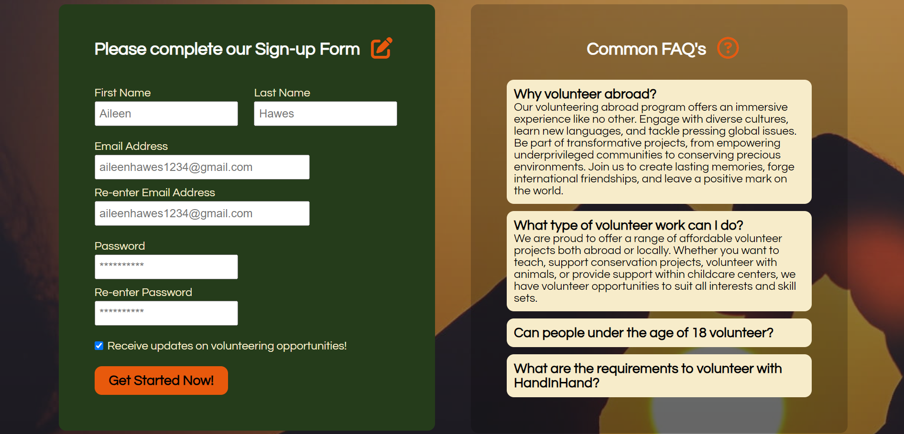

# HAND  HAND

---

**Hello Fellow Coders!**

Welcome to Hand in Hand, a volunteering hub for everyone's volunteering wants and needs. This project targets anyone who is willing to volunteer to help society and the planet as a whole in any aspect, either being location or type of volunteering.

This website aims to aid not only avid volunteers but also newbies who want to start their volunteering journey! The website does this by offering various opportunities both globally or locally (based in the UK). As well as being able to sign-up for up to date information on new opportunities to volunteer.

---

## Features

We have 4 pages. Landing and opportunities page, become a member page with sign-up form and a completed sign-up page giving the user visual confirmation of sign-up completion.

### Existing Features

- **Navigation Bar**
  - Featured on all 4 pages, includes the website name/logo and the navigation links. Theese are a Home, Opportunities and Become a member link.
  - It's identical on every page and there is an active styling on individual links to show the user which page they are currently on (apart from the completed signup page). This will aid the user with navigation without having to use the back button to navigate forwards and backwards.

- **Footer**
  - Featured on all 4 pages, includes 2 sections, one with contact details and the other with links to social media platforms.
  - The email and phone numbers are accessible directly from the icon if the user has their email/calling set up on their device. The social media links externally go to the respective websites, this is so the user doesnt lose the page they are on, on the website.

#### Landing Page

- **Landing Page Hero Section**
  - The landing page includes a background image relating to the future of the planet, with lower brightness, to give visual aid to the paragraph and CTA button on top.
  - CTA button (Join The Fight) is big and in the center providing visual hierarchy to the user to focus their attention on what I as the developer want them to click on, with an added visual animation of arrows pointing towards the CTA button.

#### Opportunities Page

- **Opportunities Section**
  - A small paragraph giving guidance on how to start their jounrey volunteering.
  - Provides a variety of horizontal card style opportunities for the user to select. They includes a background image relating to the opportunity, with an associated icon, plus a small enticing description on what it entails. A visual element added is when hovering over a oppportunity, increasing in size to help the user identify which opportunity they are focused on. The associated icon helps the user decide what type of volunteering they would like to sign-up for.
  - Each opportunity has a CTA Button and they all link to the Become a Member page. Visual aid is also given with changing background and border when hovering over it.
- **Aside section**
  - A selection of recommended external websites, using the `target_blank` attribute for creating external tab so users don't lose the webpage, that also help contribute to helping the planet/society with a description of what they do. This gives the user a variety of options not just from my website alone, making the user think my website is more official and professional.

#### Become a Member Page

- **Sign-up Form**
  - A visually easy form to fill out for sign-ups, asking basic information needed from the volunteers. Large in size for users to see and also `placeholder` attribute is used to aid users in case of uncertainty for inputs. Each input also has the `required` attribute so no section is missed.
  - CTA button (Get Started Now) on hover changes colour so the user knows what they're hovering on.
- **FAQ's**
  - 4 FAQ's in a dropdown style providing common answers to questions. Low transparency on the background to see the background image which relates to providing care and love to the world.

### Future features

- A profile page for the volunteer once they've signed up which integrates with the future feature below.
- Favouriting volunteering opportunities, which can then be viewed in your profile section.
- Always space for more volunteering opportunities, and with more could comes a filter element for finding opportunities the user wants more easily.

---

## Testing

- Testing was completed on Google Chrome, Microsoft Edge and Apple's Safari, on different devices and modes.
- Every single link goes to the intended location, with the speed of transfer to new page being quick.
- I used the Lighthouse reporting tool in Google Chrome & Microsoft Edge to test the performance of the website.
  - First time testing the performance, images massively made the webpage load time slow aswell as the animations. To correct this I reduced my image file sizes and changed their formats to ......

### Validator testing

- **HTML**
  - No errors were found using the official [W3C Validator (completed-signup.html)](https://validator.w3.org/nu/?doc=https%3A%2F%2Fcjphawes.github.io%2Fhandinhand-project-1%2Fcompleted-signup.html)
  - No errors were found using the official [W3C Validator (member.html)](https://validator.w3.org/nu/?doc=https%3A%2F%2Fcjphawes.github.io%2Fhandinhand-project-1%2Fmember.html)
  - No errors were found using the official [W3C Validator (opportunities.html)](https://validator.w3.org/nu/?doc=https%3A%2F%2Fcjphawes.github.io%2Fhandinhand-project-1%2Fopportunities.html)
  - No errors were found using the official [W3C Validator (index.html)](https://validator.w3.org/nu/?doc=https%3A%2F%2Fcjphawes.github.io%2Fhandinhand-project-1%2Findex.html)
- **CSS**
  - No errors were found using the official [(Jigsaw) Validator](http://jigsaw.w3.org/css-validator/validator?lang=en&profile=css3svg&uri=https%3A%2F%2Fcjphawes.github.io%2Fhandinhand-project-1%2Fassets%2Fcss%2Fstyle.css&usermedium=all&vextwarning=&warning=1)

### Unfixed Bugs

- None
